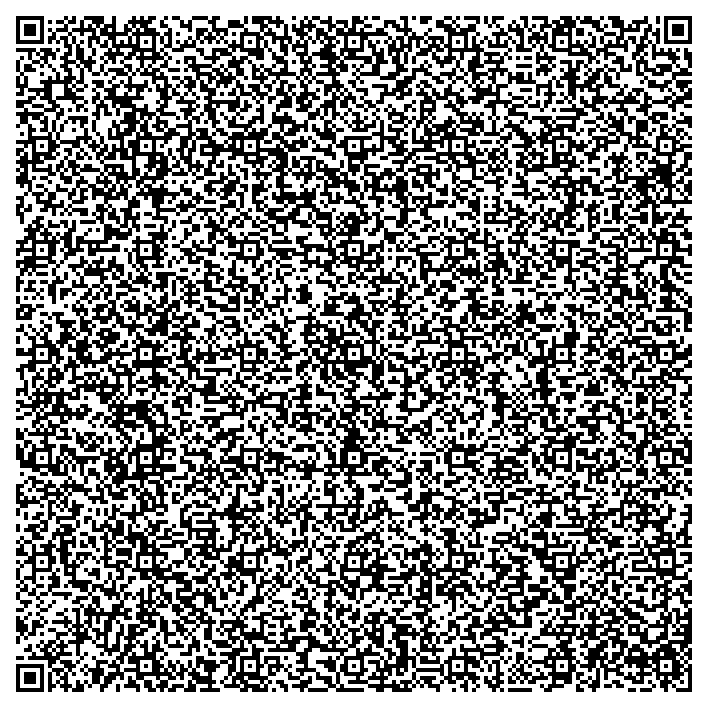

# Text Adventure Game - fits on a QR code!



This is a text adventure for the [Hack Club Saycheese event](https://saycheese.hackclub.com).

This project also includes a HTML/CSS/JS compressor and a QR code generator, based on [@webdev03's project](https://github.com/webdev03/quick-maths-saycheese/).


## Usage

### The Game

Well, just scan it! If you don't have a camera or whatever, try paste this code into your browser's address bar!

```dataUri
data:text/html;charset=utf-8,%3Cscript%3Elet%20bs%3Datob(%22lVcNb%2BM2Ev0rU%2BZuY2Nlx7tpe4XjeJF2%2B7FADy3uFjgUgYGOyZHEDUUKJGVbzea%2FH4aUHHu3QFEEcGRJfPP15s149cXbX757%2F9uv30MdG7NeDZ%2BEar2KOhpa36kd2dh5gh%2BxodVVvrsKsTe03jrVPyodWoP9sjR0uPnQhajLfiadjWTjUpKN5G%2FQ6MrOdKQmjLdq0lUdl68Wi119UzobZyU22vTLO6%2FRFAFtmAXyurzZonyovOusWhptCf2s8qg02TiJDrYuRteAZ7Ti4l%2Bv5OtvrouLclF%2BU5bTG%2BmM88uL6%2Bvrp4sKG5pt3eEx0iHOkkujMw0eZnutYr38crFoD6cmL8qyvNk6r8gvX7cHCM5oBRfb7Xa4O2NnurB8xQdbVErbavk6objDLNSo3H65gC%2FbA3zdHsBXW5wsCv6bv5o%2BbbsYnX1s0FfazqJrM0525tVi8c8zX3J4Y1Qnnlln6RN%2FvjpxJ2FGjzboqJ1dPmPC%2FDoAYaDBk2XtduQfT41%2BRbj4unxaXeWir64yP7j465XSO9DqVozJFetVm26E6Hwv1j87ZA%2Fm8%2Fnqql2vshFwVhotH24vW%2B8kkZqIENFHMb1c%2F5cvINYj4fKJ9epK6d16FaTXbVxLZ0MENqEp3D6mw0vxm%2BsAvdc7AoyAIL0LwTtUAbQFtEBW1mgjKSidpxDn8NZB7zqoHBgqIzififRGFPw9Q5baKkCInjBwI8iaQgRnk5MtxvoI41qyoBOMIdwRaEZKiBmqIWLHSq%2FJKtOD8lg5ezwf0TxAdAOE7yzgHvs3omDgpXhfj8Z1gFIbQwr2OtZQOaO%2BgG%2B7lDdPlwHQBAcITR8iee26AEF6Z8zRlCdUKYB8n%2B1FfKB0i%2BFSBnBH2e8cTTzaR6vGtASSniJI3NERPDVVfp3POQ8PRC3s0TxoW70RBQea48kZgFCjpwA6BtjroFyTTLiyJB84I6Xpc4Y4KqVDRBvBoFVHmygltZk4XqtkdCAXl6p0LpWiszmggCWZHjzFzluoXUMFbLvISB7wqHklkWHySNe0hiLNRcGJy64Pmas82hiSDw1WWqKB1u3JhwIa5Hize%2Flm2RnY6z%2FQKzB6xw9rbFtteqAdecAykp9zfh5oKe4getyRIT9mIiPJ2mlJy9H7sWRMakCoPCGn39OezYzJ13EuilSYU1Zb6KwiP2iB1LE%2FI9be8dPwXNhDa5wfmMAvOw8s9dp2dFJeNvi%2F%2FO2shVpCSSkF2IPrIrgyQeVuLICsGvJ1UoS5KHJtzwhTGk3hzykBe24CsLR%2FBgncSSkFAymyX0oHyXoHtVaK7EDmcO7XyJ9UfM74j84M5z1JSnIDDbbsyYAzakUBSZo4KDx3aJ6z9AxF9oPrc%2Bh7QhPrxMdcANjXGEG6ziiouaO2xEJTDp3MPpE68oDrnOv0nY79Utyx9kmelyD1Thv9B%2FIQGHsO1Q6t5PMka%2BuMq%2FrUfInMBaSpUTrfHCtjdMnuU5DY0g8pRczVY%2BioDQuGyuX5kzJXmfmZzIFsIH4DZeoyHeqGLCc7OfCfxKG77A14PnfScNrudNBbbXTsjyTtAgtv6obKudQBjQ6y1lS%2BEUXmzw9Jgc8YtSXpmswpD8b1aIAdQqudLVJGoquIBTZZab2LJAfBITTNXBQ5Be%2BJxeK8y8YCxPQsN5cno%2BXnvXU%2BP6Cz0XWyJlbk4ZXRwDsbtKIinT4y%2BSgzGb7IcWUGerJuz1Q50pDFJpkaMYe2TYMHtpzvnOnUuln3O8MSMRQpi9nbjgxXyesdHgVO1mgM2Srn9Bin6iiNG0%2FBmRzjqAuGZ11u9ozIKdwPs7vVMp9lJyrUlhFaLgGmQZ8qkUYC92nC%2FvWIuxTP14NljjLpmLOl0TICobfhU7FGY%2Fq5eLopOytT14wbC00fY9%2FSezrEybCI3NPm48fhep4av5hMprfrR%2BVkl%2FJVUfzeEF9%2B279Tk%2BetaTrX1pL%2F6f2%2Ff355W5Elj5F%2BadlimND0aTp9Onrw%2BePHrAHDHnQveHcRhUiLh9jkVeZe8BIhCpHKLTbDWnIveBbzy50VmzyY70WugSjEEK3Y5BXkXvD4E4XgAZWQeUW4F2muiEKcCD9b4FF5L54pIgpxokzJ3AMl0FFWB4x0uRnG1f3ZoUKcCo%2FYjMPh%2BFZmsijEaTeKzSlTxwAHnz5ji9gUikrsDMPmzXTzdE%2BbN%2FMG28mEbte%2Ff7rJjpmaXP7jkZ4up2LN%2F4%2Fr6%2B%2FT6fyD03YixPTjx08rKAZr4qTKR3JR4aaPhiLE28XN32LSrci7%2BGXaxS%2FXvIGLm7w7%2B9tA8R3nd4dm8hc0zbv8GUdpLmv0d3ESp0V8%2BbKI61uac7fH%2BsWLiTSE%2Fojup4V78cJNptOnaXG9mPJPibzHr67yr4ir9MPz%2Fw%3D%3D%22)%2Cq%3Dnew%20Uint8Array(bs.length)%3Bfor(let%20e%3D0%3Be%3Cbs.length%3Be%2B%2B)q%5Be%5D%3Dbs.charCodeAt(e)%3B(async()%3D%3E%7Bdocument.write(await%20new%20Response(new%20ReadableStream(%7Bstart(e)%7Be.enqueue(q)%2Ce.close()%7D%7D).pipeThrough(new%20DecompressionStream(%22deflate-raw%22))).text())%7D)()%3C%2Fscript%3E
```

### Build.ts

You will need to have [Bun](https://bun.sh) installed. All of the HTML/CSS/JS is in `index.html` and the script to generate the QR code is `build.ts`.

```bash
bun install # Install dependencies

bun run build.ts # Regenerate the QR code
```
